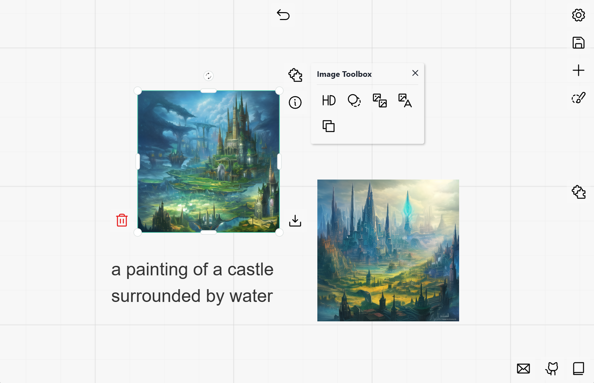

# Carefree Creator



This example migrates `carefree-creator`'s functionalities to `carefree-drawboard` 🎨:
1. Text to Image generation.
2. Image to Image generation.
3. Variation generation.
4. Super Resolution.
5. Image Matting.
6. Inpainting (Erase).
7. Stable Diffusion Inpainting (Erase & Replace).
8. And much more to come!

> See [Details](#Details) for more details!

## Install

This example requires the latest `carefree-creator` library, which can be installed by:

```bash
pip install --upgrade carefree-creator
```

## Run

```bash
cfdraw run
```

## Details

This example is a rather mature and production ready (after a few more modifications) example, it shows how can we build a web app which holds plenty of fancy AI plugins with only a few lines of codes.

There are three main scripts in this example: `utils.py`, `fields.py` and `app.py`, and it turns out that splitting codes into these three files is a good practice to maintain large project in `carefree-drawboard` 🎨. We'll dive into the details of them in the following sections.

### `utils.py`

> [examples/carefree_creator/utils.py](https://github.com/carefree0910/carefree-drawboard/blob/dev/examples/carefree_creator/utils.py)

This file should hold the core algorithms (or, APIs) you are going to use in the project. And since your algorithms / APIs may need some time consuming startup processes, it is common that we need a singleton design pattern. In this case, it might be a good choice to wrap your algorithms / APIs into a single class (let's say, `APIs`), and instantiate it under a `cache_resource` decorated function:

```python
class APIs:
   def __init__(self):
      """ Some time consuming startup processes """

   def your_algorithm(self):
      ...

   def your_api_calls(self):
      ...

@cache_resource
def get_apis() -> APIs:
    return APIs()

__all__ = ["get_apis"]
```

With the help of `cache_resource`, you can use `get_apis` everywhere casually and we'll make sure that the `APIs` is only instantiated once!

## `fields.py`

> [examples/carefree_creator/fields.py](https://github.com/carefree0910/carefree-drawboard/blob/dev/examples/carefree_creator/fields.py)

In `carefree-drawboard` 🎨, (currently) the most commonly used plugin is the [`PythonFieldsPlugin`](https://github.com/carefree0910/carefree-drawboard/wiki/Details#pythonfieldsplugin). It assumes that your APIs require a bunch of `key-value` pairs as input, so it will generate a form for you to fill in the values.

Here's a typical implementation of the `PythonFieldsPlugin`:

```python
class MyFancyPlugin(IFieldsPlugin):
    @property
    def settings(self) -> IPluginSettings:
        return IPluginSettings(
            # the `definitions` here is the key!
            pluginInfo=IFieldsPluginInfo(definitions={}),
        )
```

So the key part is the `definitions` in `IFieldsPluginInfo`, which is a `dict` that holds all the definitions of the fields you are going to use in the plugin. The `key` of the `dict` should be the `key` of the input, and the `value` of the `dict` should be one of the `IFieldDefinition`s. The `IFieldDefinition` is used to define the type/properties of the input, so users can interact with it as you expected.

> See [`IFieldDefinition`](https://github.com/carefree0910/carefree-drawboard/wiki/Details#ifielddefinition) for more details.

To demonstrate how to use `IFieldDefinition`, let's take a look at the (simplified) `diffusion_fields` we used in this example:

```python
dict(
    text=ITextField(
        label="Prompt",
        tooltip="The description of the image",
    ),
    negative_prompt=ITextField(
        label="Negative Prompt",
        tooltip="The negative description of the image",
    ),
    version=ISelectField(
        default="v1.5",
        values=allSDVersions,
        label="Model",
    ),
    sampler=ISelectField(
        default="k_euler",
        values=allSDSamplers,
        label="Sampler",
    ),
    num_steps=INumberField(
        default=20,
        min=5,
        max=100,
        step=1,
        isInt=True,
        label="Steps",
    ),
    guidance_scale=INumberField(
        default=7.5,
        min=-20.0,
        max=25.0,
        step=0.5,
        precision=1,
        label="Cfg Scale",
    ),
    seed=INumberField(
        default=-1,
        min=-1,
        max=2**32,
        step=1,
        scale="logarithmic",
        isInt=True,
        label="Seed",
    ),
    use_circular=IBooleanField(
        default=False,
        label="Circular",
        tooltip="Whether should we generate circular patterns (i.e., generate textures).",
    ),
)
```

## `app.py`

> [examples/carefree_creator/app.py](https://github.com/carefree0910/carefree-drawboard/blob/dev/examples/carefree_creator/app.py)

Once the `APIs` / `definitions` are ready, we can start to build our web app! In fact, what's still left is little:

1. Define your plugins' style (i.e., width, height, positioning...).
2. Utilize `APIs` to implement the `process` method.
3. Group your plugins together, if needed.
4. Register your plugins to the app.

And that's it!
