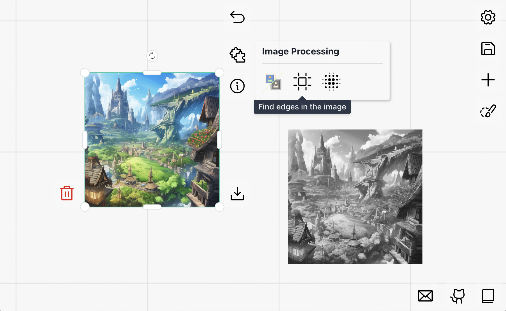

# Image Processing



This example implements three common image processing plugins with `carefree-drawboard` 🎨:
1. Any (colourful) image -> Gray scale image.
2. Extract edges of an image.
3. Apply gaussian blur to an image.

> See [Details](#Details) for more details!

## Run

```bash
cfdraw run
```

> We use `app` as the default entry name. If your script is named other than `app.py` (e.g. `{name}.py`), then run:

```bash
cfdraw run --module {name}
```

## Details

1. We used `follow=True` and `nodeConstraint=NodeConstraints.IMAGE` for all plugins, so they will and only will be displayed when the selected `Node` is an image.

> See [Plugin Positioning](https://github.com/carefree0910/carefree-drawboard/wiki/Plugin-Positioning) for more details.

2. If you run image processing consecutively, you will find a `from` field in the `meta` data. This can be used to track the process history of every `Node`.
3. We changed the `GrayScale` plugin's background color to `light green`, to show how we can specify the style of the plugin's expanded panel.
4. The `GaussianBlur` plugin has a `size` parameter, which is an `int` type. We can use `cfdraw`'s `INumberField` to create a slider for it. This is a good example of how to declare custom interactive fields, here's a quick explanation of the codes:

```python
pluginInfo=IFieldsPluginInfo(
    definitions=dict(
        size=INumberField(
            default=3,
            min=1,
            max=10,
            step=1,
            isInt=True,
            label="Size",
        )
    )
)
```

* `definitions` is a dictionary, where the key is the name of the parameter, and the value is an `IFieldDefinition` object. Since we want to create a slider for the `size` parameter, we use `INumberField` with `min` & `max` specified here.

> See [`IFieldDefinition`](https://github.com/carefree0910/carefree-drawboard/wiki/PythonFieldsPlugin#ifielddefinition) for more details.

* The name of the parameter is `size`, so we can use `size` in the `process` function to get the value of the slider.

```python
async def process(self, data: ISocketRequest) -> Image.Image:
    # `load_image` is an internal helper function to load an image (Image.Image) from `src`.
    image = await self.load_image(data.nodeData.src)
    # here we can access the value of the slider by `data.extraData["size"]`
    kernel_size = data.extraData["size"]
    return image.filter(ImageFilter.GaussianBlur(kernel_size))
```

5. We specified `upload_root` to `./` (in `cfconfig.py`), so the images/projects will be saved to the cwd (current working directory).

> Default `upload_root` is `~/.cache/carefree-draw`.
