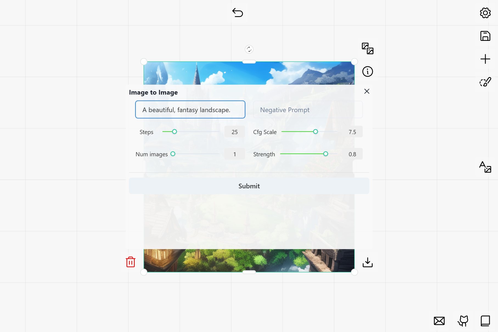

# Stable Diffusion



This example implements two common Stable Diffusion plugins with `carefree-drawboard` 🎨:
1. Text to Image generation.
2. Image to Image generation.

> See [Details](#Details) for more details!

## Install

This example requires the famous `diffusers` library, which can be installed by:

```bash
pip install --upgrade transformers diffusers[torch]
```

## Run

```bash
cfdraw run
```

We use `app` as the default entry name. If your script is named other than `app.py` (e.g. `{name}.py`), then run:

```bash
cfdraw run --module {name}
```

For example, we provide an `advanced.py`, which utilized `send_progress` to show some nice progress bars on `carefree-drawboard` 🎨. To launch it, run:

```bash
cfdraw run --module advanced
```

## Details

1. We utilized `cache_resource` to avoid re-initializing models every hot-rerun.
   * This is useful when we are focusing on the plugin styles/logic.
   * At production stage, we can call the initialization function at the very beginning to pre-load the models.
2. We used:
   * `follow=False` and `nodeConstraint=NodeConstraints.NONE` for `txt2img` plugin, so it will always be displayed (on the right of the screen).
   * `follow=True` and `nodeConstraint=NodeConstraints.IMAGE` for `img2img` plugin, so it will and only will be displayed when the selected `Node` is an image.

> See [Plugin Positioning](https://github.com/carefree0910/carefree-drawboard/wiki/Plugin-Positioning) for more details.

3. If you run image processing consecutively (e.g. first `txt2img` then `img2img`), you will find a `from` field in the `meta` data. This can be used to track the process history of every `Node`.

4. We specified `useModal=True` for these plugins, so they will always popup as a modal.

5. We specified lots of `definitions`, in order to align with the parameters exposed by the `diffusers` library.

> See [`IFieldDefinition`](https://github.com/carefree0910/carefree-drawboard/wiki/PythonFieldsPlugin#ifielddefinition) for more details.

6. We specified `upload_root` to `./` (in `cfconfig.py`), so the images/projects will be saved to the cwd (current working directory).

> Default `upload_root` is `~/.cache/carefree-draw`.
